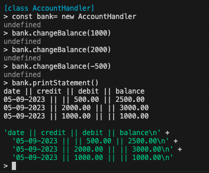

# Bank Tech Test introduction

This application is a REPL that a user can interact with via Node.
Follow the installation guide below to get started.

## Installation guide

1. Clone this repo
2. Run `npm install` to install dependencies

## how to run the code

1. Navigate to the src file
   `cd src`
2. Run `node`
3. Load the Account Handler with this command:
   `.load AccountHandler.js`
4. Instantiate a new bank account instance:
   `const bank= new AccountHandler`
5. Call a method to interact with the bank account:
    - `bank.changeBalance(amount)`
    - `bank.printStatement()`

# how to run the tests

1. Run `npm test` to run the tests

## screenshots of the REPL in action

