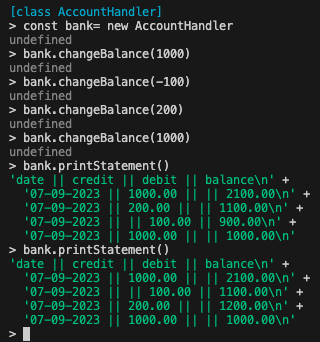

# Bank Tech Test introduction

The Bank tech test is a mock technical assessment set by Maker's Academy. [The brief is detailed here] (./planning/spec.md)

This application is a REPL that a user can interact with via Node.

Follow the installation guide below to get started.

## Installation guide

1. Clone this repo
2. Run `npm install` to install dependencies

## How to run the code

1. Navigate to the src file
   `cd src`
2. Run `node`
3. Load the Account Handler with this command:
   `.load AccountHandler.js`
4. Instantiate a new bank account instance:
   `const bank= new AccountHandler`
5. Call a method to interact with the bank account:
    - `bank.changeBalance(amount)`
    - `bank.printStatement()`

## How to run the tests

1. Run `npm test` to run the tests

## Screenshots of the REPL in action

## Design process

The program runs from three classes:

-   AccountHandler
    -   Holds the history of transactions
    -   Validates the amounts entered by the user
    -   Calls methods from the other classes to update its state and return the statement
-   StatementPrinter

    -   Takes the array of transactions as an argument
    -   Passes the array to the Transaction class to return the formatted history

-   Transaction
    -   Takes an amount as an argument
    -   Constructs with the current date and stores the amount.

This class structure was chosen to follow the Single Responsibility Principle. Each class has a single responsibility and the classes are loosely coupled.
With this structure it is easy to update, maintain and extend the code.

The program runs in node with jest managing the test facility. The dependencies are lightweight and only extend as far as necessary to meet the requirements.

To extend this program, I would implement a CLI interface to allow the user to interact with the program without having to use the REPL. The beginnings of this are stored on a branch called 'cli'.
